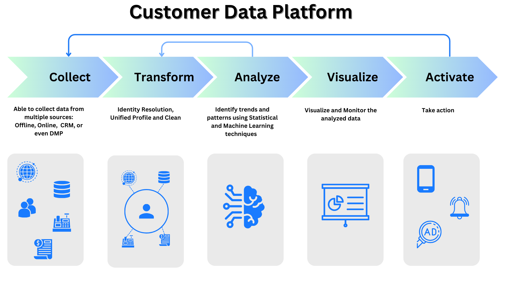
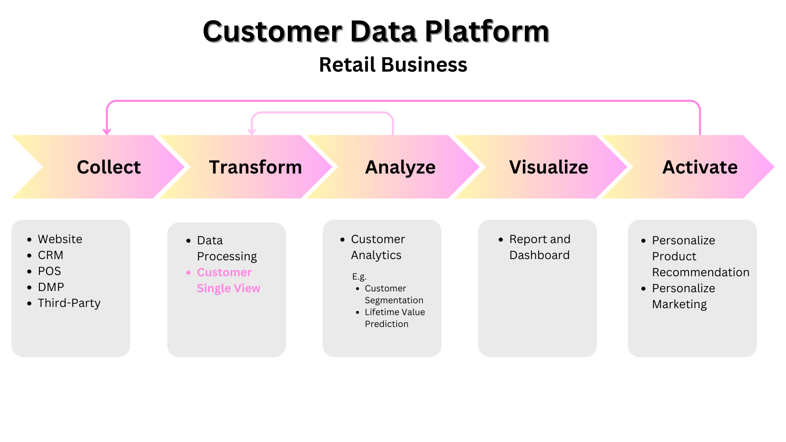

# Customer Data Platform 🔎

A customer data platform (CDP) is a software solution that creates a persistent, unifies customer database **from a variety of sources**. The goal of a CDP is to provide businesses with a 360-degree view of their customers by enabling other analytics tools to use the data and provide actionable insights.

## Stages of CDP 🌟

**Stage 1: Collect**
Collect customer data from a variety of sources, such as CRM, marketing automation, web analytics, and point-of-sale systems. This data can include customer demographics, purchase history, website activity, and social media engagement.

**Stage 2: Transform**

Clean and unify the data to ensure that it is accurate and consistent.
It involves removing duplicate records, correcting errors, and standardizing the data format.

**Stage 3: Analyze**

Use the data to gain insights into customer behavior, such as their purchase patterns, preferences, and interests.
This information can be used to create more personalized marketing campaigns and improve customer service using AI/Machine Learning.

**Stage 4: Visualize**

Create dashboards and reports to visualize the data and make it easier to understand.

**Stage 5: Activate**

Use the insights from the data to activate customer journeys.

 

 # CDP Usecase Concept 

Example CDP concept for Retail Business 
 
 

The CDP Platform for Retail Business can help them **Improved customer insights:** Help businesses gain a deeper understanding of their customers by providing a single view of their data, **Enhanced customer experience:** Help businesses enhance the customer experience by providing a more personalized and relevant experience. This can lead to increased customer satisfaction and loyalty, and **Improved decision-making:** Provide businesses with the insights they need to make better decisions about marketing, product development, and other areas. This can help businesses to improve their bottom line.

## Customer Single View 🔎

