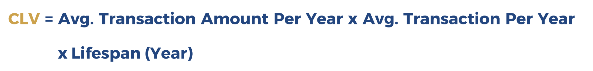
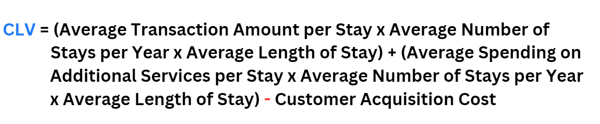
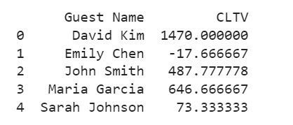

# Customer Lifetime Value 🔎
   

Customer Lifetime Value (CLV) is the measure of the value of a customer's entire relationship expected to generate from a customer over the course of their relationship with the company. 

*Remember that different businesses have different customer's behavior*

## What's in this project 💼
The following work is the **modified version** of the in-class group [assignment](https://github.com/Wkan19/MADT8101-Customer-Analytics/blob/main/Customer%20Lifetime%20Value/Dusit%20Thani%20Customer%20Loyalty%20Program.pdf) presented by Satorn Onsri, Jamjuree Kongkaew, Kittabhas Suksai, Chaiwat Premrudikul, Kiriwat Anantakul, Prawit Danpittaporn, and Worakan Charoensri (me)

This work aims to design the **hotel customer lifetime value formula**🏨

The Customer Lifetime Value Version 1 was 

 
 

In the new CLV formula, I have added the **average spending on additional services per stay**. This is a significant factor for hotels, as customers who order room service or spa treatments will have a higher CLV than those who only stay at the hotel. I have also included the customer **acquisition cost**, which is the cost of acquiring a new customer. This is important to consider, as it affects the amount of profit that a hotel can make from each customer.

💡**The new Customer Lifetime Value is**

*Assume Lifespan is 1 Year*

**Variables Definition**

* **Average Transaction Amount per Stay:** The average spending a customer makes during their stay in business. This includes room charges, dining expenses, and any other core services offered by the business.

* **Average Number of Stays per Year:** The number of times a customer returns to the hotel within a year. It accounts for repeat visits.

* **Average Length of Stay:** The average duration of a customer's stay during each visit.

* **Average Spending on Additional Services per Stay:** The average amount of money a customer spends on additional services such as spa treatments, room upgrades, or recreational activities.

* **Customer Acquisition Cost:** The expenses incurred in marketing, sales, and other efforts to acquire and retain a customer.

### Example 
* **Dataset:** [Hotel Booking](https://github.com/Wkan19/MADT8101-Customer-Analytics/blob/main/Customer%20Lifetime%20Value/GitHub%20Generate%20Hotel%20Booking.csv)
*Note: The dataset is generated*

* **Notebook:** [Customer Lifetime Value](https://github.com/Wkan19/MADT8101-Customer-Analytics/blob/main/Customer%20Lifetime%20Value/GitHub_Customer_Lifetime_Value.ipynb)

* **Result**

## Conclusion 🎯

Since businesses can measure the value of each customer or the expected monetary amount they would generate for the business, they can use this information alone or combine it with other customer analytics methods to come up with appropriate strategies to approach each customer with the aim of minimizing costs and maximizing revenue.
