# Customer Scoring 🔎
 

Customer scoring is the practice of **assigning a score to each customer** based on their value to the business. This score can then be used to *provide different treatment or privileges* to customers.

The specific Customer Scoring method that a business uses will depend on its **goals and objectives**. For example:

* Banks might use a Customer Scoring method that is based on the customer's wealth or assets under management.
* Airlines might use a Customer Scoring method that is based on the number of miles the customer has flown.

## Customer Scoring Ideas 💡

A Customer Scoring method for a business can be a *combination of multiple methods*. In this case, I will demonstrate with **Retail Business**.  

The scoring methods ideas for retail business are: 

* **Recency, Frequency, and Monetary value (RFM)**
* **Customer Lifetime Value (CLTV):**
* **Churn Score**

**Criteria Example** 
  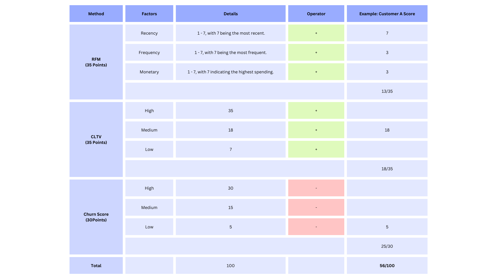

Since the business can assign scores to each customer, they can come up with different treatments for each customer. For example:

* Customers with 1-30 score points will receive regular sales promotions.
* Customers with 31-60 score points will receive extra discounts.
* Customers with 61-80 score points will receive extra discounts and cashback.
* Customers with 81-100 score points will receive extra discounts, cashback, and early-bird access to promotions. 

# Customer Churn Prediction 🔎
       
  

Customer Churn Prediction is a data-driven process in which historical customer data, analytics, and machine learning techniques are leveraged to **forecast the probability or likelihood of customers discontinuing their association with a business or service provider**. This predictive modeling approach helps organizations proactively identify at-risk customers and implement targeted strategies to retain them, ultimately reducing customer churn rates and enhancing customer satisfaction.

## What's in this project 💼
In this work, I explored the E-Commerce Customer Dataset with *Churn Prediction* to determine the probability of customer churn. I did this by **exploring the dataset, processing it, testing it with different classification models, evaluating the results, and exploring the feature importance**.

In this case, the customer I explored is a *non-contractual customer*, which means there is no clear end date for when the customer will actually churn.

* **Notebook:** [Basic Churn Prediction](https://github.com/Wkan19/MADT8101-Customer-Analytics/blob/main/Customer%20Scoring%20and%20Basic%20Churn%20Prediction/GitHub_Churn_Prediction.ipynb)

* **Dataset:** [E-commerce Customers Dataset](https://github.com/Wkan19/MADT8101-Customer-Analytics/blob/main/Customer%20Scoring%20and%20Basic%20Churn%20Prediction/EcommerceCust.csv)

* **Data Dictionary**

 

## Process ⚙️
**Notebook:** [Churn Prediction](https://github.com/Wkan19/MADT8101-Customer-Analytics/blob/main/Customer%20Scoring%20and%20Basic%20Churn%20Prediction/GitHub_Churn_Prediction.ipynb)

### Explore Data 🔦

In this step, I explored the dataset using different approaches as follows: 

* **Data Type**
  
   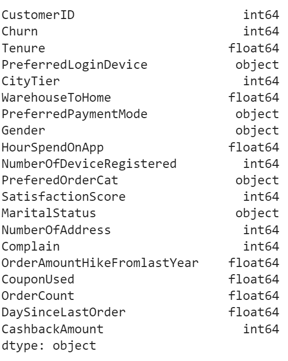

* **Check for null**

   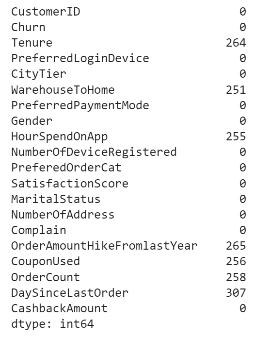

  * **Check for the unique value**

  I also explored the dataset by visualizing its variables, for example

  * **Average Tenure by Churn**
 
   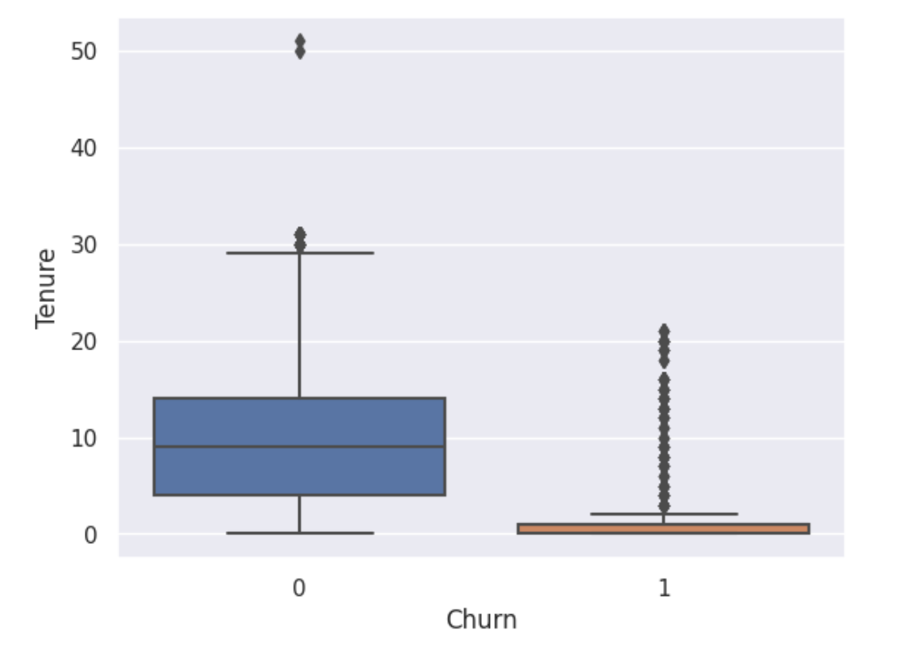

  * **Number of Customers by Churn**

   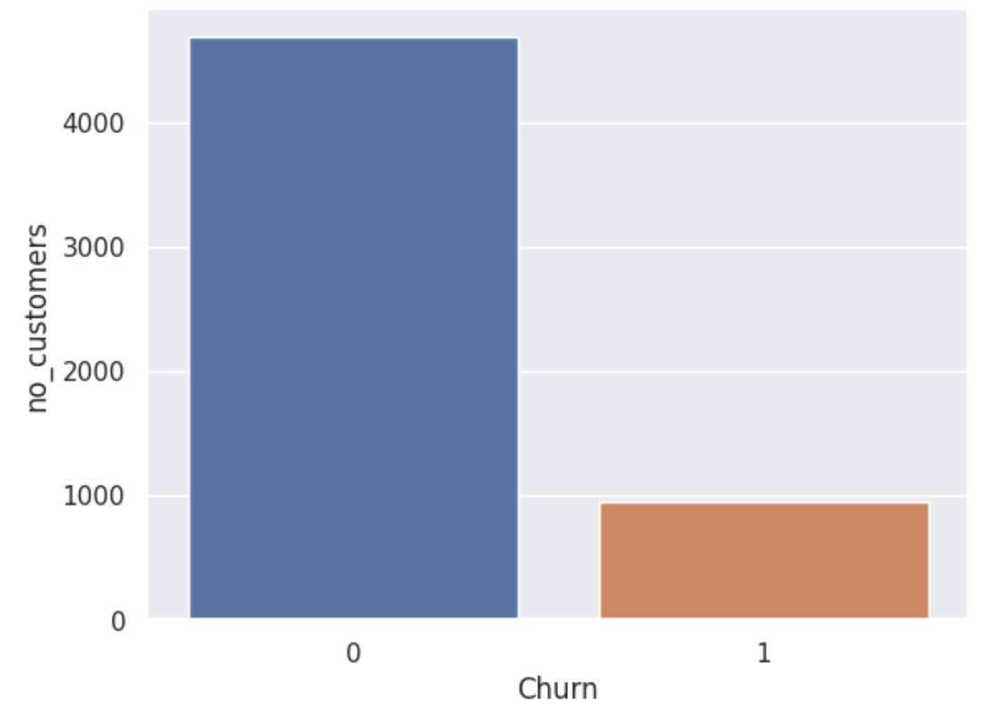

  * **Hour Spend on App by Churn**
 
  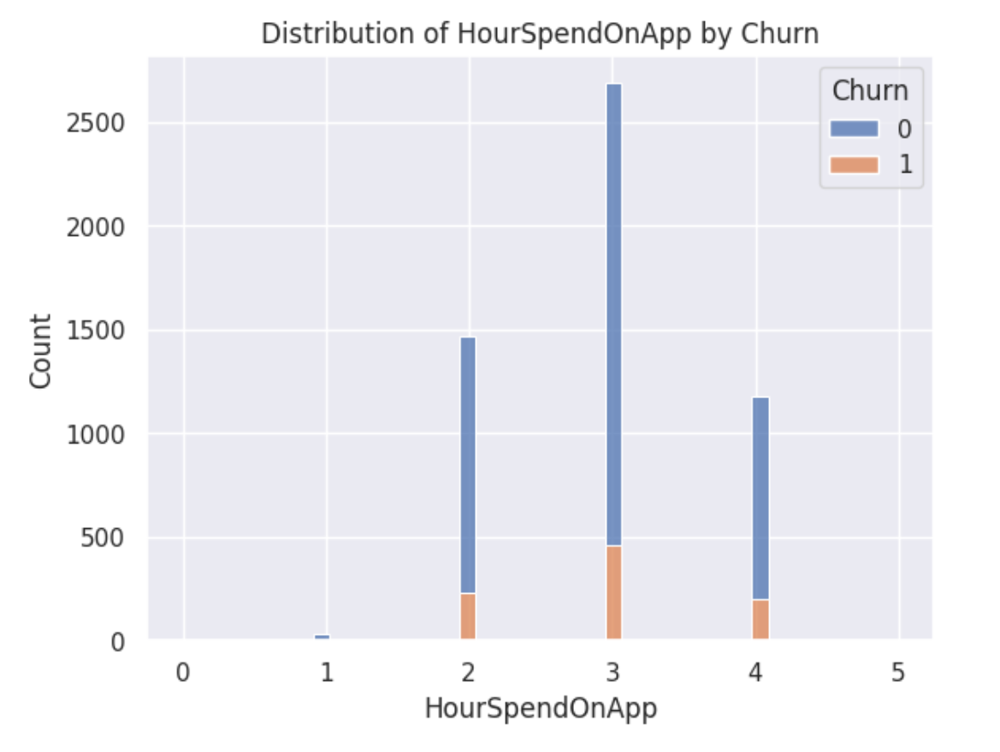

  * **Number of Coupons Used by Churn**
  
  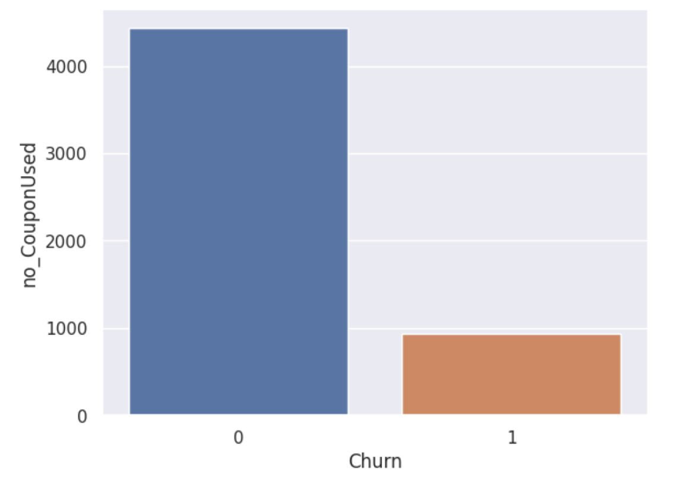

  * **Churned Customers by Number of Coupons Used**
 
  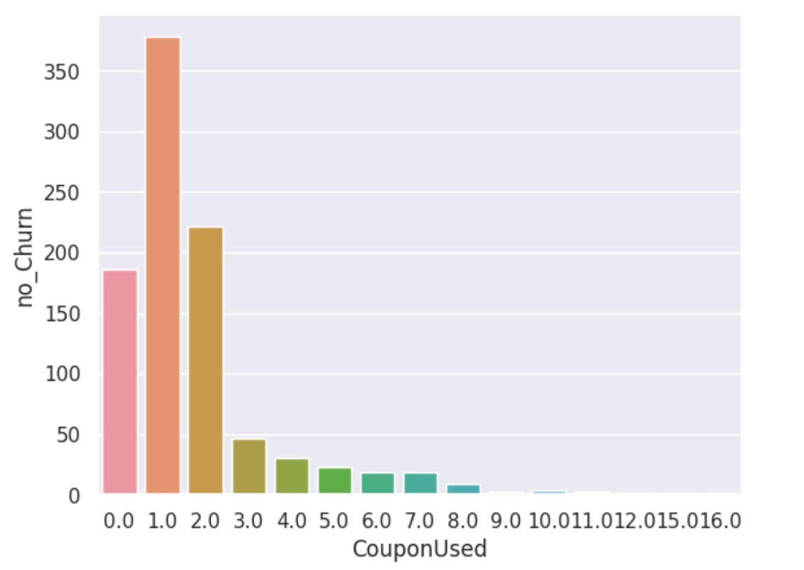
  
    
The visualization shows that churned customers tend to have shorter tenure, spend less time on the app, and use fewer coupons than non-churned customers.

### Data Cleansing and Processing 🧹⚙️

In this step, I cleaned and processed the data as follows: 

* **Handle Data Type**
* **Check and Drop Columns with more than 30% of missing value**
* **Handle Null**
* **Check and Remove Duplicate Value**
* **Check and Remove Columns with Outliers**
* **One-hot Encoding the Categorical Data**

Then after processing the data, I split the variables into X and Y for classification models. 

  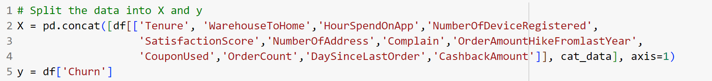

### Classification Models 🧩🔧

In this step, 60% of the data will be used for training models, while the remaining 40% will be used for testing. 

The models I experimented with are: 

* Logistic Regression
* Random Forest
* K Nearest Neighbors
* XGBoost

After that, since the data of churned customers is imbalanced, I introduced methods to handle it: 

* SMOTE
* Oversampling
* Undersampling

and also tuned the models 

### Evaluate the models 🎯

Here is the result of the experimented models.

  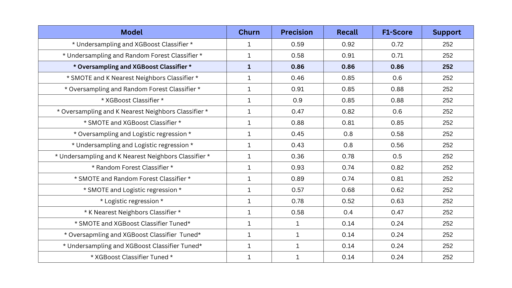

The model I selected is  **Oversampling and XGBoost Classifier** which have the evaluation as follows. 

 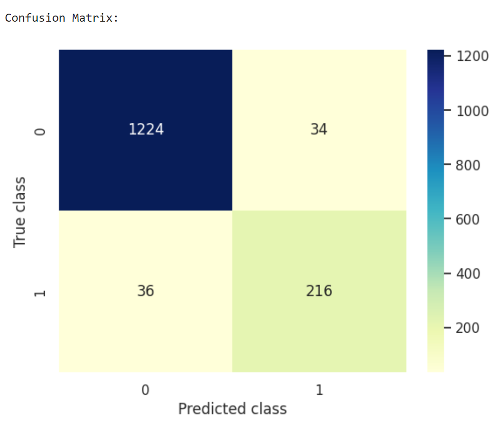

  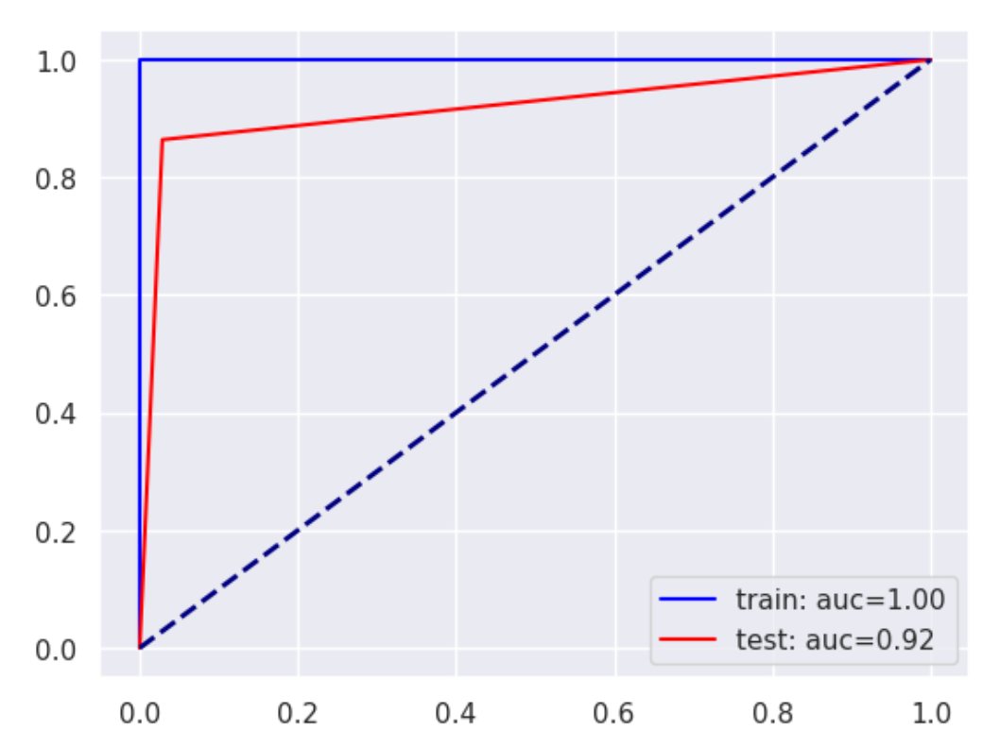

### Feature Importance 🏅

Here are the important features that contribute to the selected model:  **Oversampling and XGBoost Classifier** 

 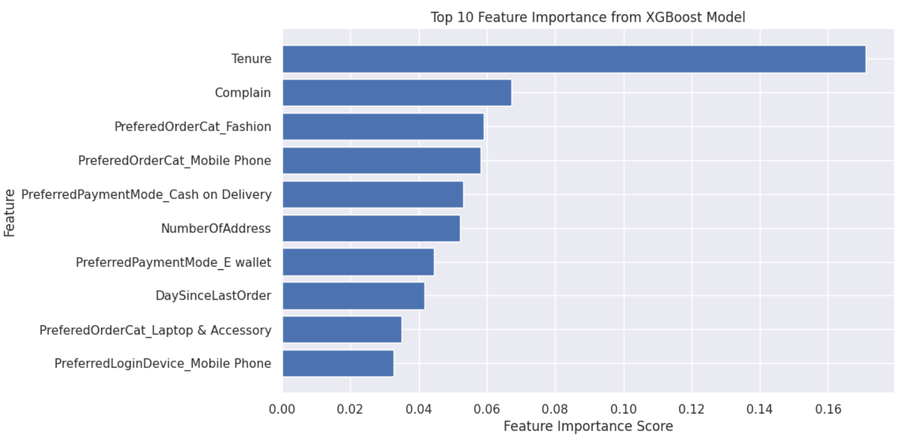
 

📌 **The business can combine the top extracted features with *Customer Scoring* to determine the score.**

 
## Business Recommendations 🌟

* The business should determine what they will do with the results of the churn prediction. They need to **decide** whether they will try to retain customers who have a high churn probability, and if so, whether it is worth the cost.
* The business should **be cautious when trying to retain customers** who are about to churn. Sometimes, the "triggers" that businesses use to try to retain customers can actually increase the churn probability.
* The business should **develop strategies** to lower the churn probability. This could involve improving customer service, offering discounts or incentives, or making changes to the product or service.

## Further Analysis

* The business can further analyze the churn prediction results to see if there are any patterns. For example, they could look at whether the churn probability is higher for certain types of customers, or at certain times of year.
* The business could also use the churn prediction results to predict whether customers who have churned will reactivate. This could help the business to target its marketing efforts more effectively.
* Finally, the business could use the churn prediction results to predict whether customers who have reactivated will churn again. This could help the business to identify customers who need extra support to stay engaged.

### Reference

* Provost, F., & Fawcett, T. (2013). Data science for business: What you need to know about data mining and data-analytic thinking. O'Reilly Media, Inc.

