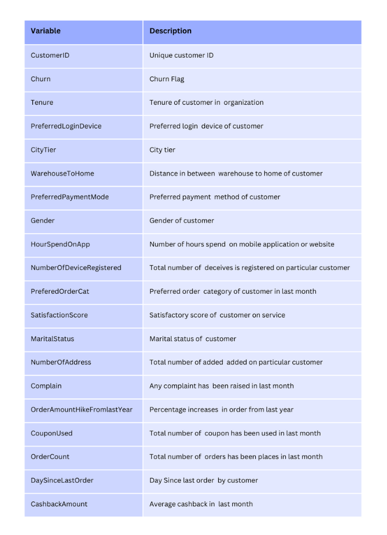

# Customer Scoring 🔎

# Customer Churn Prediction 🔎
       
  

## What's in this project 💼
In this work, I explored the E-Commerce Customer Dataset with *Churn Prediction* to determine the probability of customer churn. I did this by **exploring the data set, processing it, testing it with different classification models, evaluating the results, and exploring the feature importance**.

* **Dataset:** [E-commerce Customers Dataset](https://github.com/Wkan19/MADT8101-Customer-Analytics/blob/main/Customer%20Scoring%20and%20Basic%20Churn%20Prediction/EcommerceCust.csv)

* **Data Dictionary**

 

## Process ⚙️
**Notebook:** [Churn Prediction](https://github.com/Wkan19/MADT8101-Customer-Analytics/blob/main/Customer%20Scoring%20and%20Basic%20Churn%20Prediction/GitHub_Churn_Prediction.ipynb)

