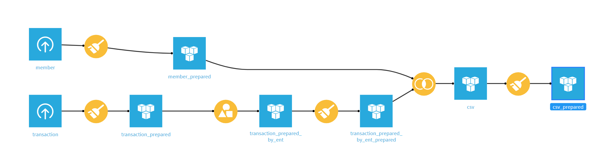
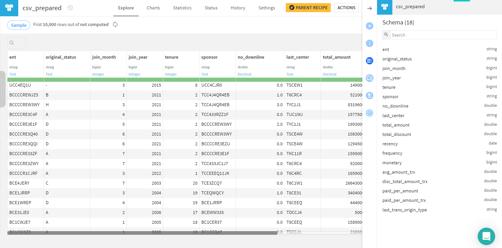
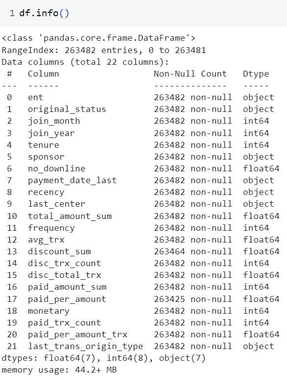
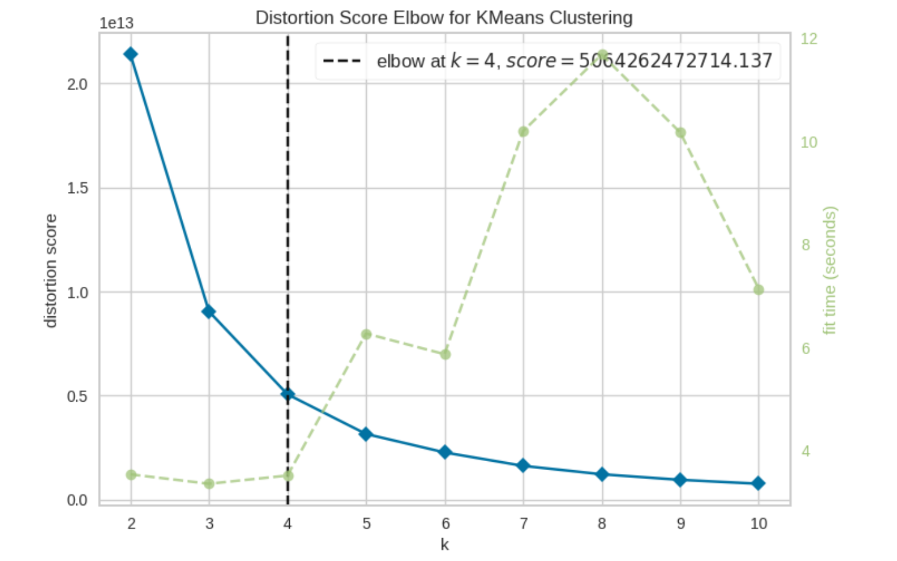
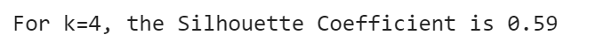
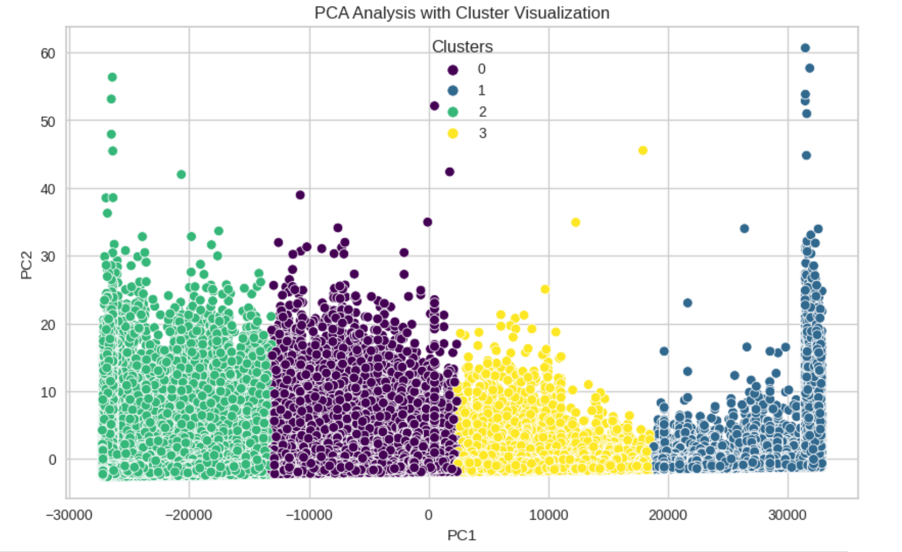
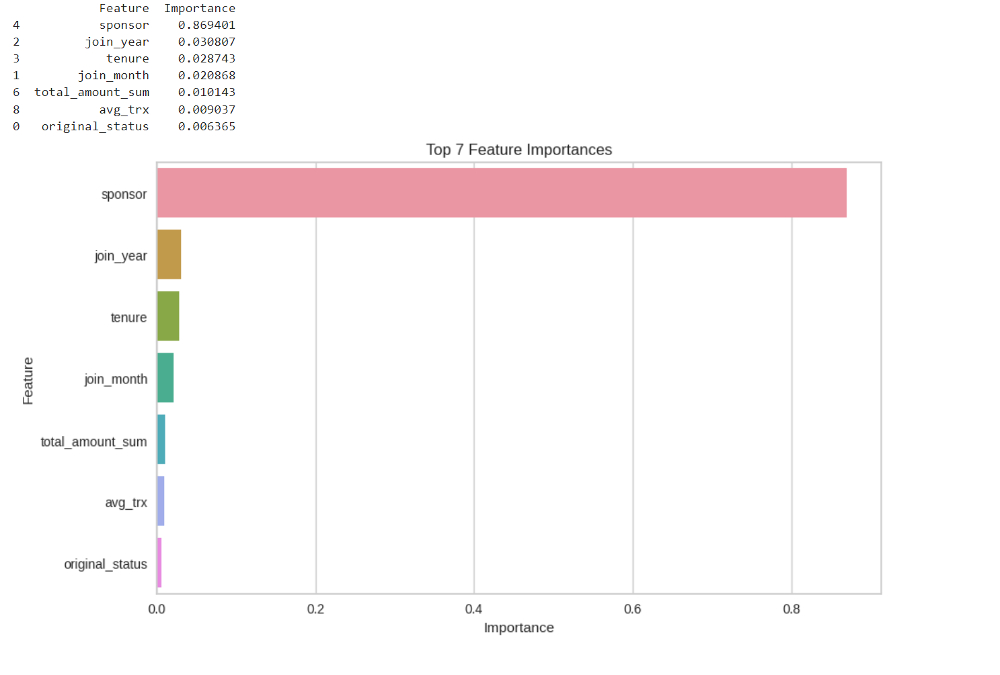

# Customer Segmentation 🔎
Customer segmentation is where customers are grouped into distinct categories based on shared characteristics. It helps businesses tailor their offerings to meet the unique needs of each group, improving customer satisfaction and profitability.

## What's in this project 💼
I used Dataiku to explore and prepare the raw datasets, and then I used Python to conduct the segmentation by grouping the members based on their features.

* **Notebook:** [Customer Segmentation](https://github.com/Wkan19/MADT8101-Customer-Analytics/blob/main/Customer%20Segmentation%20and%20Product%20Recommendation/GitHub_Customer_Segmentation.ipynb)

* **Dataset:** [Customer Single View](https://github.com/Wkan19/MADT8101-Customer-Analytics/blob/main/Customer%20Segmentation%20and%20Product%20Recommendation/csv.zip)
* There are 4 provided datasets from a **Networking Business**: 1 data member dataset and 3 transactions between 2021 - 2023 (*but since transaction 2021 has some missing data, thus I don't use it*) and I used the data member dataset to **create Customer Single View in Dataiku**

## Prepare Data to CSV 🔦
I prepared the member dataset using Dataiku, here is the work flow.
  

And this is some of the prepared dataset.
 

## Process ⚙️

* **Data Loading and Exploration:**  In addition to importing the relevant libraries and dataset, here is the information about it.
   
 
* **Convert Data Type**

* **Label Encoding:** Categorical columns like original_status, sponsor, and last_trans_origin_type are encoded using LabelEncoder to convert them into numerical values.

* **Standardization:** Numeric columns are standardized using the StandardScaler to bring all features to the same scale.

**Clustering** 

* **Elbow Method:** I used the Elbow Method to determine the optimal number of clusters (K) for customer segmentation and visualizes the results to find the most suitable K value.

  
 
K-means Clustering: Based on the selected K value, we perform K-means clustering to group customers into distinct segments. The Silhouette Coefficient is calculated to assess the quality of clustering.
* **Silhouette Score**

   

* **PCA Visualization:** Principal Component Analysis (PCA) is applied to reduce the dimension. I visualized the clusters in a scatterplot to gain insights into their distribution.
   
  
* **Result:** Here is the result [Cluster Result](https://github.com/Wkan19/MADT8101-Customer-Analytics/blob/main/Customer%20Segmentation%20and%20Product%20Recommendation/cluster_results.zip)

### Feature Importance 🏅

* **Train-Test Split:** I split the data into training and testing sets, with 40% testing.

* **Feature Scaling:** The features are scaled using StandardScaler to ensure they have the same scale.

* **Random Forest Classifier:** I used Random Forest Classifier to predict customer clusters based on feature importance toidentify which features have the most significant impact on customer segmentation.

* **Feature Importance Visualization:**  The top 7 features by importance are visualized in a bar chart for a clear understanding.
   
  
## Business Recommendations 🌟

### Reference
Reference: Kumar, V. (2010). Customer Relationship Management. Wiley. ISBN: 978-0-470-48331-0.
