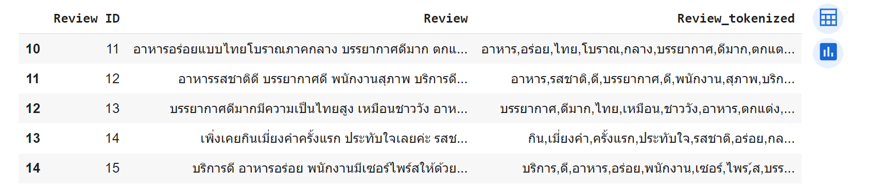
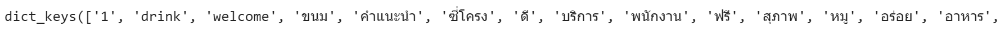
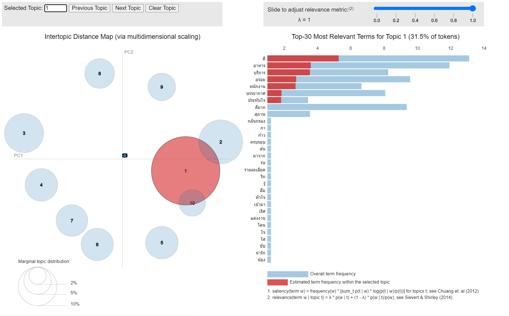

# Voice of Customer Analytics 🔎
Voice of Customer Analytics (VoC Analytics) is the process of collecting and **analyzing customer feedback** to understand their needs and wants. The feedback can be analyzed to identify trends, pain points, and opportunities for improvement. VoC Analytics can also be used to track customer satisfaction over time and to identify areas where the customer experience can be improved.

## What's in this project 💼
In this project, the customer feedback I analyzed was the review comments of customers from TripAdvisor of a restaurant in Bangkok, Thailand named *The House of Smooth Curry*

**Google Colab:**  
**Notebook:** [Voice of Customer](https://github.com/Wkan19/MADT8101-Customer-Analytics/blob/a401599f311e1860f1753ed29b6c568f7e740b56/Voice%20of%20Customer%20Analytics/GitHub_Voice_of_Customers.ipynb)

**Dataset:**  [The House of Smooth Curry Review](https://github.com/Wkan19/MADT8101-Customer-Analytics/blob/main/Voice%20of%20Customer%20Analytics/The%20House%20Of%20Smooth%20Curry%20Review.csv) 

## Process
* **Tokenize Words:** Tokenizes the words in the data set, removing stop words and other unwanted characters.
  
  
  
* **Create Dictionary:** Creates a dictionary of words, mapping each word to a unique integer ID.

  Example of creating dictionary result
  
  
 
* **Gensim Corpus:** Creates a gensim corpus, which is a representation of the data set that is used by the topic modeling algorithm.
  
* **Topic Modeling:** Performs topic modeling on the data set, using the LDA algorithm. The LDA algorithm identifies 30 topics in the data set.
  
* **Visualize Result:** Visualizes the results of the topic modeling using pyLDAvis.
  
  

  Focusing on Topic 1
  
  

As the result shows, Topic 1 indicates that customer reviews mostly praise the food, service, and atmosphere. This suggests that the restaurant has overall excellent performance in these areas.

## Benefit/ Business Recommendation/ Recommendation/ Concern 

### Reference
- What is Voice of Customer Analytics?:https://www.qualtrics.com/experience-management/customer/what-is-voice-of-customer/
- Voice of Customer Analytics: The Complete Guide: https://idiomatic.com/blog/voice-of-customer-analytics/
- How to Use Voice of Customer Data to Grow Your Brand: https://sproutsocial.com/insights/voice-of-customer/
